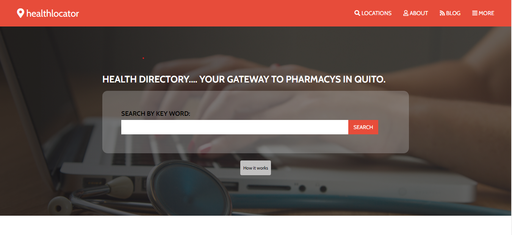

# Capstone Project About Doctors Directory

> A directory about Doctors you can find in your city, this project is based in Mathew Njuguna and Sam Achola project.

## Built With

- HTML5 / CSS3 / SASS

## Live Demo

[Live Demo Link]( https://len23.github.io/Capstone-Health-Directory/)

## Video Explanation

[Video Explanation Link]( https://www.loom.com/share/a80095435d734ce6b4da080a23b11146)

## Getting Started

- To start this project open either on a server or a browser the index.html file.

- If you want to modify some scss files and work on them, first [install sass](https://sass-lang.com/install/) on your local environment and then run the sass --watch css/scss/main_style.scss:css/style.css command in order to compile the scss files into a css file.

## Author

👤 **Lenin Montalvo**
- Github: [@len23](https://github.com/len23)
- Twitter: [@lenon468](https://twitter.com/lenon468)
- LinkedIn: [Lenin Montalvo](https://www.linkedin.com/in/lenin-montalvo-77660b1b2/)

## Acknowledgment

This project was built based on the [Mathew Njuguna](https://www.behance.net/mathewnjuguna) and [Sam Achola](https://www.behance.net/aweSam) design available on [Behance](https://www.behance.net/gallery/25563385/PatashuleKE). Thanks to them this project was possible.

## 🤝 Contributing

Contributions, issues and feature requests are welcome!

## Show your support

Give a ⭐️ if you like this project!

##

All rights reserved to Mathew Njuguna, Sam Achola and Lenin Montalvo.

